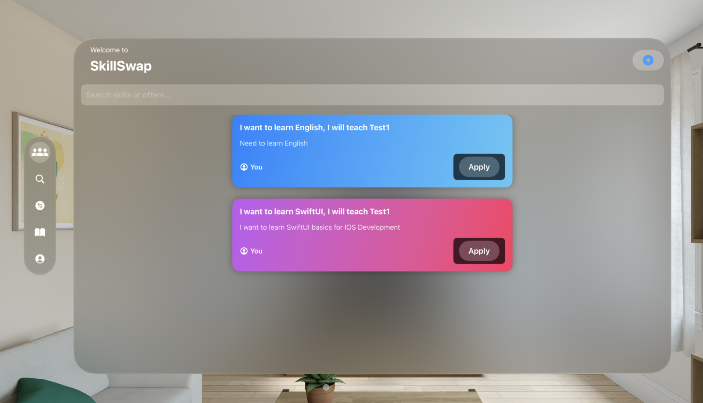
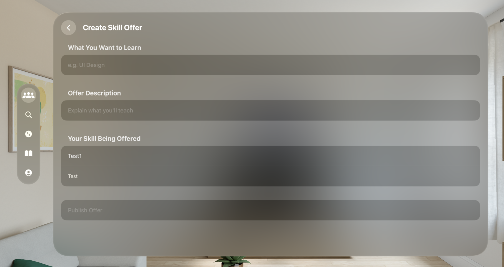
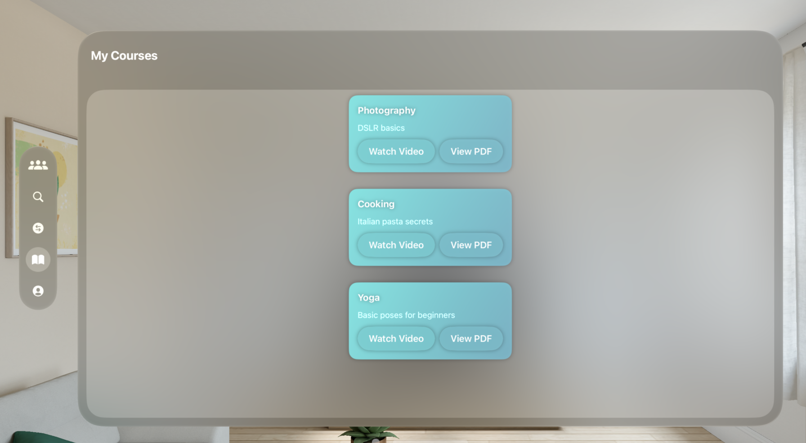
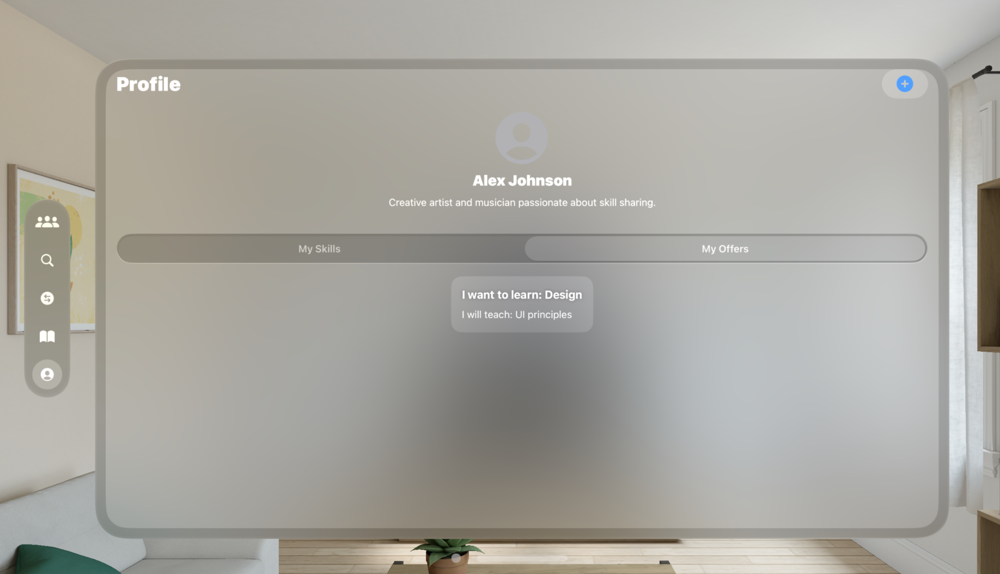

# SE4020 - Assignment 02 - VisionOS App

# Project Name - SkillSwapXR VisionOS
# Student Id - IT21809224
# Student Name - Fernando W.S.N.

#### 01. Brief Description of Project - 
SkillSwapXR VisionOS is a spatial learning exchange platform built specifically for Apple's visionOS. It allows users to browse, publish, and accept skill-sharing offers in an immersive 3D environment. Users can create offers to teach a skill in exchange for learning another, and interact with skill cards floating in space.
#### 02. Users of the System - 
Students who want to exchange academic or hobby-based skills

Professionals interested in peer-to-peer upskilling

XR/AR enthusiasts seeking immersive educational content
#### 03. What is unique about your solution -
Fully spatial UI using SwiftUI for visionOS

Interactive skill cards displayed in a stacked layout

No backend dependency — all data is managed via local storage

Each offer is linked to multimedia files (PDF/video)

Minimal design inspired by visionOS native patterns
#### 04. Major Functionality Screens - 

##### SkillFeedView:
Displays a vertical list of floating skill exchange offers with search filtering.
  

##### CreateOfferView:
Lets users select a skill they can teach, describe what they want to learn, and publish the offer.
  

##### MyCoursesView 
Displays accepted offers with access to associated PDFs or videos.
  

##### ProfileView 
Allows users to manage their skills and view offers they have posted.
  


#### 05. Learning Reflection (What you learnt doing this assignment)
Working on this assignment gave me hands-on experience in developing applications for an entirely new platform — visionOS. One of the most significant things I learned was how to adapt SwiftUI's familiar components to a 3D spatial context, which required rethinking traditional 2D layouts to accommodate immersive interactions.

I also deepened my understanding of managing app data without relying on backend services. Instead of Firebase, I utilized @AppStorage and UserDefaults to store and retrieve user data, which challenged me to think more locally and manage persistence efficiently within the app’s lifecycle.

Creating previews and structuring content in a virtual 3D space pushed me to explore spatial UI concepts like layering, depth, and spatial navigation. Testing and refining the interface within the immersive canvas was a new but rewarding experience.

This assignment not only strengthened my SwiftUI skills but also broadened my ability to design intuitive and engaging apps for the next generation of spatial computing platforms.


#### 06. UI Components used

NavigationStack for managing hierarchical navigation within the app.(SkillFeed, MyCourses etc..)

```
 var body: some View {
        NavigationStack {
            VStack(spacing: 20) {
                HStack {
                    VStack(alignment: .leading) {
                        Text("Welcome to")
                            .font(.subheadline)
                            .foregroundColor(.secondary)
                        Text("SkillSwap")
                            .font(.largeTitle)
                            .fontWeight(.bold)
                    }
                    Spacer()
                    Button {
                        navigateToCreateOffer = true
                    } label: {
                        Image(systemName: "plus.circle.fill")
                            .font(.title2)
                            .foregroundColor(.blue)
                    }
                }
                .padding(.horizontal)
                .padding(.top)
                .padding(.leading,20)

                TextField("Search skills or offers...", text: $searchText)
                    .padding(10)
                    .background(.thinMaterial)
                    .cornerRadius(10)
                    .padding(.horizontal)

```
VStack, ScrollView, and LazyVStack to arrange and present skill cards in a vertical and scrollable layout.

```
ZStack {
                RoundedRectangle(cornerRadius: 32)
                    .fill(.ultraThinMaterial)
                    .padding()
                    

                ScrollView {
                    VStack(alignment: .leading, spacing: 20) {

                        if acceptedSkills.isEmpty {
                            Text("No accepted courses yet.")
                                .foregroundColor(.gray)
                        } else {
                            ForEach(acceptedSkills) { skill in
                                courseCard(skill)
                                    .padding(.top, 10)
                                    
                            }
                        }

                        Spacer()
                    }
                    .padding()
                }
            }
            .navigationTitle("My Courses")
        }
```

TextField for user input fields such as search or offer description.(SkillFeed Search items)

```
TextField("Search skills or offers...", text: $searchText)
                    .padding(10)
                    .background(.thinMaterial)
                    .cornerRadius(10)
                    .padding(.horizontal)

```

@Binding, @State, and @EnvironmentObject for managing app state and data flow between views.

```

   @EnvironmentObject var offerStore: OfferDataStore
    @EnvironmentObject var skillStore: SkillDataStore
    @State private var searchText: String = ""
    @State private var navigateToCreateOffer = false

``` 


#### 07. Documentation 

(a) Design Choices

``` 
Focused on minimalism and clarity in immersive space

Adopted system-consistent color schemes and spacing

Used natural depth and floating layout to match visionOS philosophy 
```

(b) Implementation Decisions
```
All user data (skills, offers) is stored locally using JSON in UserDefaults

SkillDataStore and OfferDataStore classes act as single sources of truth

View layering uses 3D spacing and adaptive grid sizes
```

(c) Challenges
```
Debugging layout in spatial previews without a physical Vision Pro

Ensuring UI was readable and functional in space using only basic SwiftUI components

Simulating persistent data in a non-backend environment
```

#### 08. Reflection

Developing a visionOS app was a unique experience, particularly working with immersive layouts and space-based UI design. The challenge of building without backend support required creative solutions using local storage. If I were to do this again, I would start with storyboards or mockups to visualize spatial UI early and plan out user interactions accordingly.


#### 09. AI Usages 

##### Prompt: 
    “How can I store skill offers locally using UserDefaults in SwiftUI?”

##### Response:
    “You can use @AppStorage or UserDefaults.standard along with JSON encoding. Here's a SkillDataStore Response: “You can use @AppStorage or UserDefaults.standard along with JSON encoding. Here's an example of how to create a SkillDataStore class that saves and loads skill data from local storage.”

        class SkillDataStore: ObservableObject {
        @Published var skills: [Skill] = [] {
            didSet {
                saveSkills()
            }
        }

        private let key = "skills_key"

        init() {
            loadSkills()
        }

        func loadSkills() {
            if let data = UserDefaults.standard.data(forKey: key),
            let decoded = try? JSONDecoder().decode([Skill].self, from: data) {
                self.skills = decoded
            }
        }

        func saveSkills() {
            if let data = try? JSONEncoder().encode(skills) {
                UserDefaults.standard.set(data, forKey: key)
            }
        }
    }
    

##### Prompt: 
    “Offer card is not saving properly – what’s wrong with my JSON save?”
##### Response: 
     “You forgot to convert your Offer struct to Data using JSONEncoder().encode().”

 ##### Prompt: 
    “I want to create a stacked card layout in visionOS that displays offers in 3D. Any suggestions?”
##### Response: 
     “Use LazyVStack inside a ScrollView, limit width, and apply .background(.ultraThinMaterial) for spatial stacking"

